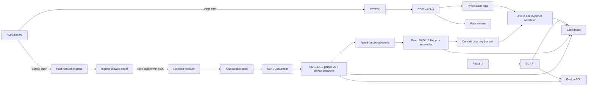

# Архитектура

## Контекст

Один production-хост обслуживает до 10 SMG-1016M и пиково 100 CPS. Горячий аналитический слой рассчитан на 12 месяцев; raw и агрегаты хранятся до 3 лет согласно локальной политике retention/backup.

## Компоненты

- `collector-ingress`: тот же stateless image в роли `ingress`; host-network UDP receiver фиксирует реальный source IP/port в отдельном `ingress.db` и передаёт подтверждёнными batch через локальный Unix socket.
- `collector`: image в роли `app`; HTTP API, device validation, Syslog worker и CDR watcher запускаются как независимые goroutines с общим graceful shutdown. Сервис остаётся в Docker-сетях `default` и `proxy`.
- `PostgreSQL`: control plane — users/sessions, devices, ingest file ledger, export jobs и audit.
- `ClickHouse`: immutable raw Syslog/CDR, typed RADIUS fragments, собранные
  AntiFraud lifecycle, exact call-event links, неоднозначные correlation candidates
  и агрегаты.
- `durable spool`: две независимые BoltDB-очереди. `ingress.db` удерживает datagram до ACK после device validation и записи в `syslog.db`; `syslog.db` удерживает envelope до JetStream publish. Файлы не открываются двумя процессами одновременно; повреждённые envelopes атомарно переносятся в quarantine bucket.
- `NATS JetStream`: disk-backed work queue между spool publisher и parser; без time-based eviction, duplicate window 72 часа, лимит 20 GiB и `discard=new`, чтобы переполнение оставляло данные в local spool. Некорректные envelopes сохраняются в отдельном `SYSLOG_DLQ`.
- `MinIO`: неизменяемые исходные CDR. Архивация Syslog в MinIO пока не реализована; canonical raw-копия хранится в ClickHouse.
- `SFTPGo`: FTP endpoint, динамическая отдельная учётная запись и home каждого SMG.
- `Nginx Proxy Manager`: существующий внешний TLS/reverse proxy в Docker-сети `proxy`; Collector доступен ему как `smg-collector:8080`, но app port и инфраструктурные API наружу не публикуются.

## Границы надёжности

UDP Syslog не имеет acknowledgement: packet может потеряться на SMG, сети или до попадания в ingress process. После этого datagram удаляется из ingress spool только после ACK основного Collector, а из app spool — только после JetStream acknowledgement. Один `event_id` проходит через оба spool; повторная передача безопасно перезаписывает BoltDB key, а `Nats-Msg-Id=event_id` подавляет повторную публикацию после crash. При заполнении JetStream новая публикация отклоняется и остаётся в spool вместо удаления старых сообщений. Далее событие обрабатывается at-least-once. CDR имеет stronger durability: файл остаётся на FTP volume до raw archive и успешной фиксации результата.

CDR сначала получает SHA-256 и запись ledger. Повтор с тем же `device_id + sha256` не импортируется повторно. Строка дедуплицируется по полному Eltex sequence number, но source file/row остаются в provenance.

Parser version `smg-3.410-v6` разделяет envelope, component classification и typed
attributes. Durable rebuild последовательно читает raw по integer microsecond cursor,
пакетно строит `syslog_facts`, `cdr_time_facts`, `radius_fragments` и
`antifraud_lifecycles` в новой timezone revision. Активная revision не удаляется и
остаётся read model до проверки counts и короткой catch-up фазы.

Eltex/RFC3164 wall clock интерпретируется в активной IANA timezone устройства, а timestamp
исходного CDR SMG — как UTC. Оба потока переводятся в canonical UTC instant; raw wall
clock, source timezone и offset сохраняются отдельно. Смена interpretation schema/timezone
создаёт shadow revision. После snapshot replay выполняется ограниченный cutover с
фиксированным watermark, затем ClickHouse публикует новый read model.

Batch RADIUS assembler переносит Acct-Session-Id из любого fragment и ограничивает
повторное использование call context временным occurrence. Новые Syslog/CDR факты
ставят только `device + revision + day` в durable dirty queue. Set-oriented exact
Acct-Session-Id/SIP Call-ID/GCR и composite matching выполняются внутри малого day/signature
набора. `call_assignments` хранит одну versioned assignment на lifecycle со состоянием
`exact`, `composite`, `ambiguous` либо `orphan`; повторный запуск заменяет stale link.

## Изоляция устройств

- Syslog принимается только от IP, зарегистрированного в `devices.syslog_source_ip`.
- FTP login/home генерируется отдельно для каждого `device_id`.
- `device_id` входит во все order keys, correlation keys и API paths.
- Удаление устройства удаляет control-plane конфигурацию и FTP principal; аналитические данные требуют отдельной retention/purge процедуры.

## Масштабирование

На одном узле основная вертикальная нагрузка приходится на ClickHouse и disk IOPS NATS/MinIO. Для перехода выше 100 CPS:

1. разнести ClickHouse data и object storage на отдельные диски;
2. запускать receiver и workers отдельными replicas;
3. заменить single-node ClickHouse на replicated cluster;
4. вынести PostgreSQL/MinIO backup за пределы хоста.

## Целевые SLO

- HTTP availability: 99.5% в пределах single-host ограничения;
- accepted Syslog → searchable p95: менее 5 секунд;
- completed FTP file → searchable p95: менее 60 секунд;
- RPO: до 24 часов при потере всего хоста, RTO: до 4 часов;
- внутри collector после JetStream publish — отсутствие silent loss.
