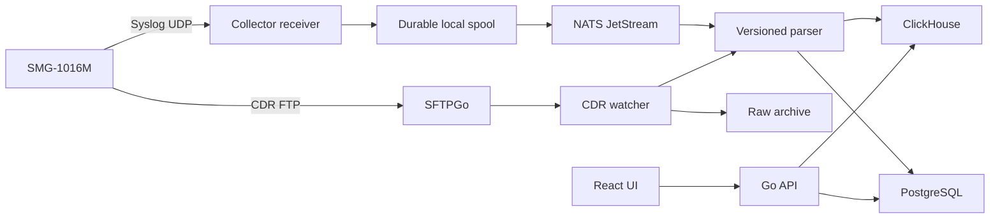

# Архитектура

## Контекст

Один production-хост обслуживает до 10 SMG-1016M и пиково 100 CPS. Горячий аналитический слой рассчитан на 12 месяцев; raw и агрегаты хранятся до 3 лет согласно локальной политике retention/backup.

## Компоненты

- `collector`: один stateless image; HTTP API, UDP receiver, Syslog worker и CDR watcher запускаются как независимые goroutines с общим graceful shutdown.
- `PostgreSQL`: control plane — users/sessions, devices, ingest file ledger, export jobs и audit.
- `ClickHouse`: append-oriented raw Syslog, CDR, RADIUS facts, call-event links и агрегаты.
- `durable spool`: локальная BoltDB-очередь; datagram фиксируется на диске до попытки публикации и переживает недоступность/restart NATS.
- `NATS JetStream`: disk-backed work queue между spool publisher и parser; retention и duplicate window 72 часа, лимит 20 GiB.
- `MinIO`: неизменяемые исходные CDR, далее — архивные Syslog batches и XLSX jobs.
- `SFTPGo`: FTP endpoint, динамическая отдельная учётная запись и home каждого SMG.
- `Nginx Proxy Manager`: существующий внешний TLS/reverse proxy в Docker-сети `proxy`; Collector доступен ему как `smg-collector:8080`, но app port и инфраструктурные API наружу не публикуются.

## Границы надёжности

UDP Syslog не имеет acknowledgement: packet может потеряться на SMG, сети или до попадания в process. После записи в local spool сообщение не удаляется до JetStream acknowledgement; `Nats-Msg-Id=event_id` подавляет повторную публикацию после crash. Далее событие обрабатывается at-least-once. CDR имеет stronger durability: файл остаётся на FTP volume до raw archive и успешной фиксации результата.

CDR сначала получает SHA-256 и запись ledger. Повтор с тем же `device_id + sha256` не импортируется повторно. Строка дедуплицируется по полному Eltex sequence number, но source file/row остаются в provenance.

## Изоляция устройств

- Syslog принимается только от IP, зарегистрированного в `devices.syslog_source_ip`.
- FTP login/home генерируется отдельно для каждого `device_id`.
- `device_id` входит во все order keys, correlation keys и API paths.
- Удаление устройства удаляет control-plane конфигурацию и FTP principal; аналитические данные требуют отдельной retention/purge процедуры.

## Масштабирование

На одном узле основная вертикальная нагрузка приходится на ClickHouse и disk IOPS NATS/MinIO. Для перехода выше 100 CPS:

1. разнести ClickHouse data и object storage на отдельные диски;
2. запускать receiver и workers отдельными replicas;
3. заменить single-node ClickHouse на replicated cluster;
4. вынести PostgreSQL/MinIO backup за пределы хоста.

## Целевые SLO

- HTTP availability: 99.5% в пределах single-host ограничения;
- accepted Syslog → searchable p95: менее 5 секунд;
- completed FTP file → searchable p95: менее 60 секунд;
- RPO: до 24 часов при потере всего хоста, RTO: до 4 часов;
- внутри collector после JetStream publish — отсутствие silent loss.
