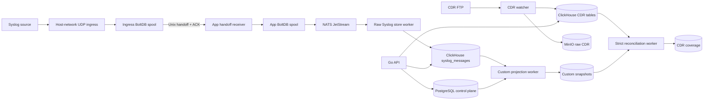

# Архитектура

Пайплайны Collector: Syslog → ClickHouse, CDR → archive/CH, Custom AntiFraud,
coverage, VoIPmonitor, export. Операции — [deployment.md](deployment.md);
модель AF — [correlation.md](correlation.md).

```mermaid
flowchart LR
    SMG[Syslog source] --> Ingress[Host-network UDP ingress]
    Ingress --> ISpool[Ingress BoltDB spool]
    ISpool -->|Unix handoff + ACK| Receiver[App handoff receiver]
    Receiver --> ASpool[App BoltDB spool]
    ASpool --> NATS[NATS JetStream]
    NATS --> Raw[Raw Syslog store worker]
    Raw --> Messages[(ClickHouse syslog_messages)]
    Messages --> Custom[Custom projection worker]
    PG --> Custom
    Custom --> Projection[(Custom snapshots)]
    FTP[CDR FTP] --> Watcher[CDR watcher]
    Watcher --> Archive[(MinIO raw CDR)]
    Watcher --> CDR[(ClickHouse CDR tables)]
    CDR --> Reconcile[Strict reconciliation worker]
    Projection --> Reconcile
    Reconcile --> Coverage[(CDR coverage)]
    API[Go API] --> Messages
    API --> CDR
    API --> PG[(PostgreSQL control plane)]
```

---

## Граница надёжности Syslog

UDP сам по себе без ACK. После accept datagram один и тот же `event_id` проходит
ingress spool → acknowledged Unix handoff → app spool → JetStream. Удаление из
spool — только после ACK следующей durable-границы. `Nats-Msg-Id=event_id`
подавляет дубликат publish после crash.

Consumer пишет immutable transport-запись в `syslog_messages` и ACK NATS сразу
после успешного raw persist. Парсинга в consumer **нет**. Durable discovery в
PostgreSQL сканирует immutable-таблицу и идемпотентно ставит UTC-hour buckets
для устройств с AntiFraud. Временный сбой enqueue в PG не дублирует raw и не
теряет последующую проекцию.

---

## Границы хранения

| Слой | Что хранит |
|------|------------|
| PostgreSQL | users, sessions, devices, ingest/export ledgers, retention, runtime settings, projection/reconciliation jobs, audit |
| ClickHouse | `syslog_messages`, Eltex/Satel CDR, Custom AF snapshots, coverage, VoIP links |
| MinIO | raw CDR (`cdr/`), export artifacts (`exports/`) |

`syslog_messages` — единственная граница для движка `customradius`. PostgreSQL
владеет policy revision, discovery/bucket jobs, generation, deadlines, per-device
lease (≤1 running job на SMG), deployment-wide heavy-lane lock на write/cutover,
watermarks.

Claim предпочитает устройства с самым старым watermark и на устройстве порядок
`open UTC-hour → discover → older backlog`, чтобы live tip не голодал. Discover
курсоры идут в admission-классе `custom_reconcile` (не heavy).

Часы выше `projection.maxEvents` грузятся split-окнами hour→15m→5m→1m in-process.
Windowed rebuild держит **предыдущий active tip** видимым до **одного** finalize
cutover (lease продлевается перед CH write). Packets/calls принадлежат first-seen
5m-окну часа: вызов, пересекающий окна, может остаться неполным до следующего
полного finalize — во время rebuild авторитетен предыдущий tip.

Каждый arrival инкрементирует generation bucket, в том числе под lease.
Active marker — граница видимости; retries используют deterministic snapshot ID;
superseded → tombstones; raw rows replay не обновляет и не удаляет.

Session recompute: exact engine identities + `custom_radius_session_events` для
ограниченных indexed windows. `NextDeadline` — durable cutoff без нового arrival.

Toggle `antifraudEnabled`: перед cutover проверяется policy revision под
device-scoped advisory lock. Enable → discovery jobs; disable → cancel live jobs,
disabled markers, coverage `not_applicable`, raw Syslog не трогается.

---

## Роли Compose

| `COLLECTOR_ROLE` | Владение |
|------------------|----------|
| `ingress` | Host-network UDP edge |
| `app` | All-in-one (default) |
| `api-ingest` | HTTP + NATS raw consumer + CDR watcher |
| `export` | Только async export worker |
| `maintenance` | Projection/replay, reconciliation, retention |

Split-профиль: `docker compose --profile split up --scale collector=0`.
Одновременно с default `collector` не запускать — дублирование ownership.

---

## Миграции (контур)

- CH 022: create/copy `syslog_messages`; preflight — counts + digests.
- Cleanup legacy Syslog-derived — только после verified copy
  ([syslog-storage-migration.md](syslog-storage-migration.md)).
- Custom projection / coverage — CH 024–026 (+ refresh views 028/029).
- PG: durable queues, generation/deadline, runtime settings (до **023**), …
- CH VoIP links — **030**. Все миграции завершаются до старта workers.

---

## CDR и coverage

Ingest Eltex/Satel независим от Syslog rebuild. Timezone reinterpretation CDR
не запускает Syslog rebuild.

Каждый typed Eltex CDR insert сразу пишет coverage `expected` (AF on) или
`not_applicable` (AF off). Primary match — exact normalized Acct-Session-Id;
H323 fallback — только unique значение из реального CDR field. Номера/время
кандидата не выбирают.

Карточки AF: device-scoped `custom_antifraud_calls FINAL` (не «голый»
`*_current`) под Interactive **512 MiB**; enrichment soft-fail с warnings,
не false-404.

Views `*_current` создаются как `SELECT *` на момент CREATE: после
`ALTER TABLE … ADD COLUMN` нужна recreate view в той же миграции (028/029).
Если list работает, а detail 404 после schema add — первым проверьте drift view.

---

## Ограничения (инженерные)

- Finalize-only tip (нет mid-hour progressive activate).
- Single-host, не HA.
- Export и `custom_replay` делят одну heavy lane (см. [security-performance.md](security-performance.md)).
- Source IP isolation только через host-network ingress.
