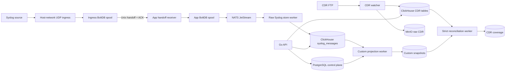

# Architecture

```mermaid
flowchart LR
    SMG[Syslog source] --> Ingress[Host-network UDP ingress]
    Ingress --> ISpool[Ingress BoltDB spool]
    ISpool -->|Unix handoff + ACK| Receiver[App handoff receiver]
    Receiver --> ASpool[App BoltDB spool]
    ASpool --> NATS[NATS JetStream]
    NATS --> Raw[Raw Syslog store worker]
    Raw --> Messages[(ClickHouse syslog_messages)]
    Messages --> Custom[Custom projection worker]
    PG --> Custom
    Custom --> Projection[(Custom snapshots)]
    FTP[CDR FTP] --> Watcher[CDR watcher]
    Watcher --> Archive[(MinIO raw CDR)]
    Watcher --> CDR[(ClickHouse CDR tables)]
    CDR --> Reconcile[Strict reconciliation worker]
    Projection --> Reconcile
    Reconcile --> Coverage[(CDR coverage)]
    API[Go API] --> Messages
    API --> CDR
    API --> PG[(PostgreSQL control plane)]
```

## Reliability boundary

UDP itself has no acknowledgement. Once ingress accepts a datagram, the same
`event_id` passes through the ingress spool, acknowledged Unix handoff, app
spool, and JetStream. Spool deletion happens only after the next durable
boundary acknowledges it. `Nats-Msg-Id=event_id` suppresses duplicate publish
after a crash.

The NATS consumer writes the immutable transport record directly to
`syslog_messages` and acknowledges NATS as soon as raw persistence succeeds.
The durable PostgreSQL discovery job continuously scans the immutable table
and idempotently enqueues new UTC-hour buckets for enabled devices. A temporary
PostgreSQL enqueue failure therefore cannot force duplicate raw delivery or
lose later projection. The transport consumer itself does no parsing.

## Storage boundaries

PostgreSQL stores users, sessions, devices, ingest/export ledgers, retention,
and audit state. ClickHouse stores immutable Syslog, Eltex CDR, Satel RTU CDR,
and CDR time interpretations. MinIO stores immutable source CDR files.

`syslog_messages` is the extension boundary for the pure `customradius`
engine. PostgreSQL owns policy revisions, durable discovery/bucket jobs,
generation counters, deadline cursors, deployment-wide leases, and watermarks.
Every arrival increments its bucket generation, including arrivals while a
worker owns the lease. ClickHouse stores staged complete snapshots. A final
active marker is the visibility boundary; retries reuse the deterministic
snapshot ID, superseded rows receive tombstones, and raw rows are never
updated or deleted by replay.

Session recomputation uses exact engine identities plus
`custom_radius_session_events` to expand bounded indexed windows across UTC
hours or days. `NextDeadline` creates a durable cutoff job, so unanswered
requests time out without another arrival.

Toggle races are resolved by checking the PostgreSQL policy revision before
cutover under a device-scoped PostgreSQL advisory lock shared by all roles and
instances. Enable creates durable Syslog and CDR discovery jobs. Disable cancels live
jobs, writes disabled markers and not-applicable CDR coverage, and leaves raw
Syslog untouched.

## Migration boundary

ClickHouse migration 022 creates and copies `syslog_messages`. Application
preflight compares source/destination counts and deterministic aggregate
digests, including payload bytes and stored hash, and checks the old PostgreSQL
rebuild queue. A PostgreSQL advisory lock serializes the complete ClickHouse
migration ledger check, execution, and recording across instances. Migration 023 is allowed
to remove legacy Syslog-derived objects only after that validation. All
migrations finish before workers start.

Migrations 024 and 025 create the Custom projection and CDR coverage model.
Migration 018 creates the new durable PostgreSQL queue; it does not reuse the
deleted legacy parser queue.
PostgreSQL migration 020 adds generation/deadline state and leased
reconciliation. ClickHouse migration 026 adds finalized link/exchange views and
the session-event index.

See [the migration runbook](syslog-storage-migration.md).

## CDR independence

Eltex and Satel typed CDR ingestion remain active. CDR timezone reinterpretation
does not invoke a Syslog rebuild. `cdr_time_interpretations`,
`cdr_time_facts`, `satel_rtu_cdr`, and `satel_rtu_cdr_time_facts` are retained
through cleanup.

Every typed Eltex CDR insert immediately writes `expected` coverage for an
enabled device or `not_applicable` for a disabled device. CDR and Custom call
arrivals dirty the same UTC reconciliation buckets. The fair scheduler also
ages expected rows without new arrivals. Exact normalized Acct-Session-Id is
the only primary key; H323 fallback requires a unique value from a real CDR
field. Number and time similarity never select a candidate.
