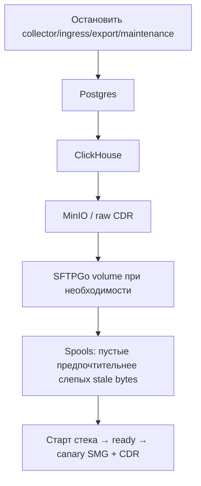

# Развёртывание и эксплуатация

Единый операторский гайд Collector на одном Docker-хосте (Portainer + Nginx Proxy Manager).
Это **не** HA: один хост, один стек, внешний бэкап.

Смежные документы: [доступ и UI](auth-and-ui.md), [экспорт](exports.md),
[AntiFraud / coverage](correlation.md), [безопасность и SLO](security-performance.md),
[карта документации](README.md).

---

## 1. Назначение и границы

Collector принимает Syslog (UDP) и CDR (FTP) от Eltex SMG и typed CDR Satel RTU,
хранит сырьё и проекции в ClickHouse, control-plane — в PostgreSQL, raw CDR — в MinIO.

| В зоне Collector | Вне зоны (ваша ответственность) |
|------------------|----------------------------------|
| Compose-сервисы, health, retention API | Хостовый файрвол / ACL до SMG |
| UI, RBAC, runtime settings | DNS и сертификаты NPM |
| Projection / coverage / export workers | Физический бэкап off-host |
| Образ `ghcr.io/finenumbers/collector:latest` | Выбор и патчинг хоста ОС |

---

## 2. Хост и сеть

Рекомендуемый старт для ~10 SMG / 100 CPS peak:

- Linux x86_64, 16 vCPU, 64 GiB RAM;
- NVMe ≥2 TiB, отдельный backup target;
- Docker Engine 27+, Portainer;
- NTP, UPS;
- management VLAN с маршрутами от шлюзов.

Диск уточняйте после 7-дневного canary: объём Syslog зависит от уровня логирования на порядки.

### Порты (что слушает стек)

| Порт | Кто | Назначение |
|------|-----|------------|
| `${SYSLOG_PORT:-514}/udp` | `collector-ingress` (host network) | Syslog от SMG; сохраняет реальный source IP |
| `${FTP_PORT:-21}/tcp` | SFTPGo | CDR upload |
| `50000–50100/tcp` | SFTPGo | Passive FTP data |
| `8080/tcp` | `collector` (только сеть `proxy`) | UI/API за NPM; **не** публиковать на хост |
| `127.0.0.1:18081` | ingress health | Локальная проверка приёма |

Не публикуйте PostgreSQL, ClickHouse, NATS, MinIO, SFTPGo HTTP. На хосте не должно быть
чужого rsyslog/syslog-ng на том же UDP-порту.

---

## 3. Compose: сервисы и роли

Файл: [`deploy/compose.yml`](../deploy/compose.yml). Образ приложения:
`ghcr.io/finenumbers/collector:latest`, везде `pull_policy: always`
(переменная `COLLECTOR_VERSION` не используется).

| Сервис | `COLLECTOR_ROLE` | Роль |
|--------|------------------|------|
| `collector-ingress` | `ingress` | Host-network UDP → durable spool → handoff |
| `collector` | `app` | API/UI + ingest/projection (монолитный профиль) |
| `collector-api` | `api-ingest` | Split: API + ingest без heavy export/maintenance |
| `collector-export` | `export` | Split: async export worker |
| `collector-maintenance` | `maintenance` | Split: retention / фоновые maintenance |
| `postgres`, `clickhouse`, `nats`, `minio`, `sftpgo` | — | Инфраструктура |

По умолчанию в стеке крутится роль `app` (+ ingress). Split-профиль включается
профильными сервисами compose (см. комментарии в `compose.yml`): тогда heavy lane
export/maintenance отделены от interactive API.

Volumes (ключевые): данные Postgres/ClickHouse/MinIO/NATS, `sftpgo_data`, durable
spools (`ingress.db`, `syslog.db`). Сырой CDR-архив — в MinIO под префиксом `cdr/`.

Сеть `${PROXY_NETWORK:-proxy}` — **external**, уже существует у NPM; alias приложения
`smg-collector`.

---

## 4. Portainer + Nginx Proxy Manager

1. External Docker-сеть `proxy` (или имя из `PROXY_NETWORK`), подключена к NPM.
2. Git Stack: `https://github.com/finenumbers/collector`, path `deploy/compose.yml`,
   reference `main`.
3. Environment из [`.env.example`](../.env.example): четыре **независимых** секрета
   ≥32 символов, `PUBLIC_HOST`, `TZ`, `SECURE_COOKIES=true`.
4. Deploy / Redeploy. Сборка на Portainer не нужна — всегда pull `:latest`.
5. В NPM Proxy Host:
   - Scheme `http`, Forward Hostname `smg-collector`, Port `8080`;
   - SSL, Force SSL, HTTP/2, Block Common Exploits.
6. Убедитесь, что host не держит `${SYSLOG_PORT}/udp` до старта ingress.

`collector-ingress` в host network единолично занимает UDP-порт. Bridge publish
ломает изоляцию по source IP (SNAT в адрес gateway) — так делать нельзя.

---

## 5. Секреты и first bootstrap

Обязательные секреты (не коммитьте значения):

- `POSTGRES_PASSWORD`
- `CLICKHOUSE_PASSWORD`
- `MINIO_ROOT_PASSWORD`
- `SFTPGO_ADMIN_PASSWORD`

Опционально (split ClickHouse users): `CLICKHOUSE_API_*`, `CLICKHOUSE_EXPORT_*`,
`CLICKHOUSE_MAINTENANCE_*`.

В production (`ENVIRONMENT=production`) стек **отклоняет** дефолтный Postgres URL вида
`postgres://collector:collector@…` и другие seeded secrets из примеров.
Токена `BOOTSTRAP_TOKEN` **нет**: первый администратор создаётся через UI/API
`POST /api/bootstrap` пока `bootstrapped=false` (см. [auth-and-ui.md](auth-and-ui.md)).

Проверка:

```bash
curl -fsS "https://<домен>/api/bootstrap/status"
# {"bootstrapped":false} → создайте admin в UI
```

---

## 6. Health

| Endpoint | Смысл |
|----------|--------|
| `GET /health/live` | Процесс жив |
| `GET /health/ready` | PostgreSQL + ClickHouse доступны; **compose healthcheck** роли `app` |
| `http://127.0.0.1:18081/` | Ingress на хосте принимает (только localhost) |

После deploy:

```bash
curl -fsS "http://127.0.0.1:18081/"
# через NPM — готовость API:
curl -fsS "https://<домен>/health/ready"
```

---

## 7. Онбординг источников

После создания источника атомарно создаются UUID, шаблон, SFTPGo principal с home
`/srv/cdr/<device_id>`, одноразовый FTP password, allowlist source IP и parser profile
(для шаблонов с Syslog/typed CDR). При ошибке SFTPGo device откатывается.

### Eltex SMG-1016M

Шаблоны:

| Ключ | Когда |
|------|--------|
| `eltex-smg-1016m-3.410` | Профиль прошивки 3.410 |
| `eltex-smg-1016m-3.23.2` | Профиль 3.23.2 |

На шлюзе:

1. Syslog → `PUBLIC_HOST`:`SYSLOG_PORT`, facility/severity как принято у вас.
2. FTP/CDR → выданные login/password, passive ports, Device Sign в CDR должен
   совпадать с настройкой источника в Collector.
3. IANA timezone устройства — из списка в карточке SMG (wall clock CDR).
4. Для AntiFraud: включите `antifraudEnabled` только после canary
   (см. [ниже](#14-canary-и-catch-up) и [correlation.md](correlation.md)).

Проверка: datagramы с реального IP SMG в Syslog UI; один CDR-файл в «Вызовы и CDR».

### Satel RTU

Шаблон: `satel-rtu-cdr-v1` (`Satel RTU`).

1. Выберите timezone, в которой записаны timestamp файла.
2. Загрузите CDR с 120-column header в корень FTP home.
3. Login с префиксом `ssw_`; Syslog IP и AntiFraud для этого источника **не** настраиваются.
4. Сбой MinIO/ledger оставляет локальный файл для retry.

Проверка: строки во вкладке «Вызовы и CDR», объект в MinIO `cdr/…`.

---

## 8. Runtime settings и лимиты контейнеров

Операционные tunables живут в PostgreSQL и правятся в **Настройки → Параметры**
(`GET`/`PATCH /api/system/runtime-settings`). Группы: `projection`, `coverage`,
`voipmonitor`, `platform`, `containers`.

Значения в `.env` (`CUSTOM_PROJECTION_*`, `CDR_COVERAGE_*`, `VOIPMONITOR_*`, …) —
**только seed** пустой БД. После первого boot авторитетен UI/DB.

Лимиты CPU/RAM контейнеров: после сохранения скачайте
`/api/system/runtime-settings/container-limits.env`, перенесите в host `.env`,
затем `docker compose up -d --force-recreate` (копия также в
`/data/spool/container-limits.env`).

`platform.clickhouseAdmissionCapacity` действует на **новые** запросы сразу;
уже идущие запросы сохраняют прежние лимиты до завершения.

Каталог ключей — в [auth-and-ui.md](auth-and-ui.md#параметры-runtime).

---

## 9. Retention (4 класса, 7–1095 дней)

Админ: `GET` / `PATCH /api/system/retention`.

| Класс | Что контролирует |
|-------|------------------|
| `syslog` | только `collector.syslog_messages` |
| `cdr` | CDR оборудования (Eltex) в ClickHouse |
| `softswitch_cdr` | таблицы Satel RTU (и будущие typed softswitch) |
| `raw_cdr_archive` | lifecycle MinIO только на префикс `cdr/` |

Каждый класс: **7–1095** дней, default **1095**. Изменение применяется сразу;
PATCH ждёт advisory-locked reconciliation. Отмена pending: `"cancel": true`.

Reconcile: при старте и ежечасно. ClickHouse TTL — по allowlist таблиц/колонок.
**Не** являются целями retention: `ingest_files`, NATS streams, durable spools.

Политика становится active только когда все ресурсы класса приняли изменение;
иначе остаётся pending с `lastError` для hourly retry.

> Устаревшая формулировка «удаление через 36 месяцев» как единственный контракт
> **неверна**: операторский контракт — policy API 7–1095d. Миграции CH могут
> задавать TTL по умолчанию; после reconcile действует политика из PostgreSQL.

---

## 10. Backup / restore / ротация секретов

### Ежедневный бэкап

- `pg_dump -Fc collector` (users, devices, jobs, settings);
- backup/snapshot БД ClickHouse `collector`;
- MinIO / volumes raw CDR;
- volume `sftpgo_data` + compose/env секреты.

Храните off-host, шифруйте. Раз в квартал — drill restore.

### Порядок restore



1. Остановить app-роли (volumes не трогать при частичном DR).
2. Postgres → проверить counts `users` / `devices`.
3. ClickHouse → sample `syslog_messages`, `cdr_records` / Satel за окно.
4. MinIO → spot-check ключ из `ingest_files`.
5. SFTPGo — если нужны те же FTP home/credentials.
6. Spools (`ingress.db`, `syslog.db`): при corruption лучше пустые + live catch-up.
7. Старт; `/health/ready`; login; canary Syslog + CDR; AF list при необходимости.

После частичного restore ledger jobs и CH могут расходиться — requeue failed projection
из Диагностики до доверия coverage SLO.

### Ротация секретов

По одному сервису, короткое окно:

1. Postgres → env → recreate postgres + collector roles.
2. ClickHouse → env → recreate clickhouse + collector.
3. MinIO → env → recreate minio + collector.
4. SFTPGo admin → env → recreate sftpgo + collector; device FTP passwords —
   one-time UI secrets (перевыдача при необходимости).
5. Проверить `ENVIRONMENT=production`, `SECURE_COOKIES=true`.

---

## 11. Мониторинг и алерты

Админ-панель **Диагностика** (`GET /api/system/diagnostics`, lazy): очередь Custom
projection (depth/lag/failed/backfill), **per-device** watermark/AF lag, classification
gap, coverage states и SLO, orphans/ambiguity, reconciliation, export queued/running/oldest.

Глобальный `lagSeconds` может быть зелёным при stall одного SMG. Операторский критерий:
`maxDeviceLagSeconds`, `anyDeviceFailed`, `anyClassificationGap`, SLO в `projectionDevices`.

Обязательные сигналы:

- restart контейнеров;
- depth/size обоих spool (`ingress.db`, `syslog.db`);
- handoff errors; NATS lag/storage;
- per-device projection lag >5 мин или `failed>0`;
- classification gap; coverage late+missing >1% после grace;
- возраст CDR ingest; disk >75/85%;
- ClickHouse insert errors; SFTPGo unavailable; возраст бэкапа.

ClickHouse query ceilings (in-process): Interactive **512 MiB** / 2 threads (UI),
CustomReplay 1 GiB / 1 thread, CustomReconcile 256 MiB, Export 512 MiB. Не ставьте
жёсткие Docker memory caps ниже этих потолков без измерений на выделенном хосте.

---

## 12. Инциденты

| Симптом | Действие |
|---------|----------|
| FTP недоступен | Eltex буферизует CDR в RAM (до ~30 MB) — восстановите FTP до заполнения |
| NATS down / 20 GiB | Datagrams в `spool_data`; старые JS-сообщения не вытесняются — следите за диском и lag |
| Основной Collector down | Ingress пишет в `ingress.db`; после восстановления handoff replay с исходными IP/port |
| Ingress `address already in use` | Освободите `${SYSLOG_PORT}/udp` на хосте; не возвращайте bridge publish |
| ClickHouse down | JetStream держит Syslog; CDR остаётся в volume + raw archive/ledger |
| Upgrade с legacy `raw_syslog` | Stop app → `pg_dump` + CH snapshot → `migration-preflight` до cleanup; не продолжать при `copyVerified=false` — [syslog-storage-migration.md](syslog-storage-migration.md) |

---

## 13. Upgrade

1. Убедитесь, что бэкап свежий.
2. Если инсталляция ещё на legacy `raw_syslog` — только
   [migration-preflight](syslog-storage-migration.md).
3. Portainer: Redeploy stack с `main` → pull `:latest` (`pull_policy: always`).
4. Дождитесь `/health/ready`, миграций PG/CH, login.
5. Canary: один SMG Syslog + один CDR; при AF — drain projection без роста failed.

Версии приложения — annotated git tags `vX.Y.Z`; GH Actions публикует GHCR и GitHub Release.
Вручную `gh release create` не требуется.

---

## 14. Canary и catch-up

### Canary CDR ↔ Custom AntiFraud

1. Одно SMG с `antifraudEnabled=true`, drain очереди projection.
2. Diagnostics: `coverageSloMet` / `projectionSloMet`, нет роста orphans/ambiguity.
3. Пары по normalized `Acct-Session-Id`; разные session ID — разные вызовы.
4. Во время replay — oldest projection age и CPU: live budget не должен голодать.
5. Только после успеха — остальные SMG.

### Catch-up: stall проекции на одном SMG

Симптом: syslog/CDR свежие, AF/coverage отстают часами на одном устройстве;
global lag может врать.

1. `projectionDevices`: `failed`, `lastError`, `watermarkLagSeconds`, `classificationGap`.
2. Ошибки `exceeds … events` / `memory bound`: снизьте async export; поднимите
   `projection.maxEvents` (≥50000), `projection.maxMemoryBytes` (≥256MiB),
   `projection.sleep=1s`; `threads=2` допустим (per-device lease).
3. Requeue: `POST /api/devices/{deviceID}/projection/requeue-failed` или SQL
   `UPDATE custom_projection_jobs SET status='pending', attempts=0, … WHERE device_id=$1 AND status='failed'`.
4. Worker при overflow режет час на окна 5m (при необходимости 1m). Snapshot tip
   активируется **только на финальном cutover** (finalize-only) — предыдущий tip
   остаётся видимым во время rebuild, чтобы карточки не ломались на partial snapshot.
5. `classificationGap` при пустых AF headers — проблема логирования на SMG, не MaxEvents.
6. Drain: per-device lag ≤5 мин.
7. Toggle `antifraudEnabled` off→on — только после поднятых лимитов, если нужен новый backfill.

---

## 15. Известные ограничения

| Ограничение | Смысл для оператора |
|-------------|---------------------|
| Finalize-only tip | UI видит предыдущий snapshot до cutover окна; mid-hour progressive tip нет |
| Call freeze across 5m windows | Длинный вызов, пересекающий окна rebuild, может «заморозить» поля до следующего reconcile |
| `SELECT *` views | Схема view может отставать от таблицы до явной миграции — не полагайтесь на «невидимые» колонки без проверки |
| Interactive 512 MiB | Плотные AF-часы: карточки/list могут OOM (CH 241), если host перегружен export/replay |
| Single-host | Нет failover; DR = restore с бэкапа |
| Source IP isolation | Только host-network ingress; иначе все SMG «с одного IP» |

---

## 16. Быстрая проверка после установки

```bash
curl -fsS "http://127.0.0.1:18081/"
curl -fsS "https://<домен>/health/ready"
curl -fsS "https://<домен>/api/bootstrap/status"
```

Дальше: создать admin → добавить SMG/Satel → Device Sign / FTP / Syslog → один файл CDR →
при необходимости AF canary → смотреть Диагностику.
